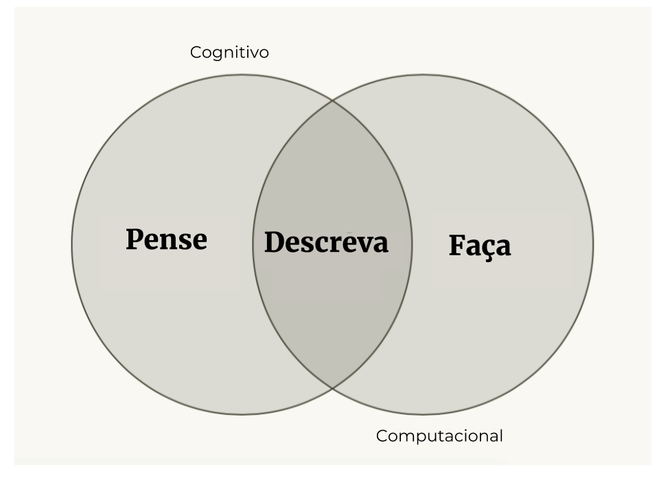

class: inverse, middle, center

# bit.ly/curso-r-fgv

---
class: inverse, middle, center

# Quem somos?

---
## curso-r


---

## curso-r

- Primeiros cursos em 2015, no programa de verão do IME-USP

- Curso-R surge oficialmente em 2017

- Em 2018, começamos a pegar projetos de consultoria, e surge a R6

- Desde 2017, são mais de 30 cursos e 500 alunos

<br>

.pull-left[

]

.pull-right[

]


---

## Habilidades importantes para um cientista de dados

* Curiosidade

* Análise crítica

* Conhecer o método científico

* Modelar

* Programar


---

class: inverse, middle, center

# Por que programar?

---
## O computador é a ferramenta do cientista de dados

 

---
## Precisamos nos comunicar com o computador

 

---
## Point-click vs linguagens de programação

<br>

.pull-left[

]


.pull-right[

]

---

# O que são linguagens de programação?

<br>
<br>

> Uma linguagem de programação é um vocabulário e um conjunto de regras gramaticais que servem para instruir um computador a executar uma tarefa específica.

ou

> é o jeito de conversar com o computador.

---
class: center, middle

### Por que programar é preferível?

<br>

# 1. Código é texto
# 2. Código é legível
# 3. Código é aberto

---
class: middle, center, inverse

# Código é texto

---
class: middle, center

### Copiar & Colar 


---
class: middle, center

### Stack Overflow


---
class: middle, center, inverse

# Código é legível

---

```{r message=FALSE, warning=FALSE, include=FALSE}
library(magrittr)
library(magick)
library(ggplot2)
library(dplyr)
library(viridis)
```

```{r, eval = FALSE}
image_read("https://jeroen.github.io/images/frink.png") %>%
  image_rotate(270) %>%
  image_background("blue", flatten = TRUE) %>%
  image_border("red", "10x10") %>%
  image_annotate("Liguagens de programação ainda\nsão linguagens!", 
                 color = "white", size = 30)
```


.pull-left[

]


--

.pull-right[
```{r, eval = TRUE, echo = FALSE}
image_read("https://jeroen.github.io/images/frink.png") %>%
  image_rotate(270) %>%
  image_background("blue", flatten = TRUE) %>%
  image_border("red", "10x10") %>%
  image_annotate("Liguagens de programação ainda\nsão linguagens!", 
                 color = "white", size = 30)
```
]


---

## Código te dá confiança de que está certo!


---
class: middle, center, inverse

# Código é aberto

---

# Grátis

* Estudantes podem usar as mesmas ferramentas que os profissionais
* Todos podem usar as melhores ferramentas independente do poder financeiro
* Qualquer um pode reproduzir as suas análises


# Aberto

* Você pode corrigir problemas
* Você pode desenvolver suas próprias ferramentas

## Todas as linguagens de programação modernas são open-source.

---

# A linguagem R

* R é uma linguagem de programação


* R é Open Source


* R possui uma comunidade muito ativa de desenvolvedores

+

* R foi criado para fazer análise de dados.

---
class: inverse, middle, center

# Por que usar o R?

---

## Ciclo da ciência de dados


---

## Ciclo da ciência de dados


---
class: inverse, middle, center

## Por que usar o R?


O R é a **cola**.

# Exemplos

## Vamos ao R!

